# AI-PLC with Amazon Quick Hands-on User Guide

> **版本**：V0.2
> **工具**：Amazon Quick Desktop

---

## 目录

1. [前置准备](#1-前置准备)
2. [导入 Skills](#2-导入-skills)
3. [Skill 工作流程总览](#3-skill-工作流程总览)
4. [Step 1：深度研究（Deep Research）](#4-step-1深度研究deep-research)
5. [Step 2：头脑风暴写 PRD（Brainstorm）](#5-step-2头脑风暴写-prdbrainstorm)
6. [Step 3：生成实施计划（Plan）](#6-step-3生成实施计划plan)
7. [Step 4：执行计划（Execute）](#7-step-4执行计划execute)
8. [测试生成的 Skill](#8-测试生成的-skill)

---

## 1. 前置准备

### 1.1 安装并登录 Amazon Quick Desktop

1. 从 [Amazon Quick 下载页](https://aws.amazon.com/quick/download/) 下载并安装 Desktop 版本。

2. 打开第一封 Amazon Quick 邀请邮件。记下 `You have been invited to join the "<Quick Account Name>" account` 中双引号内的 **Quick Account Name**，然后点击 **Click to accept invitation**。

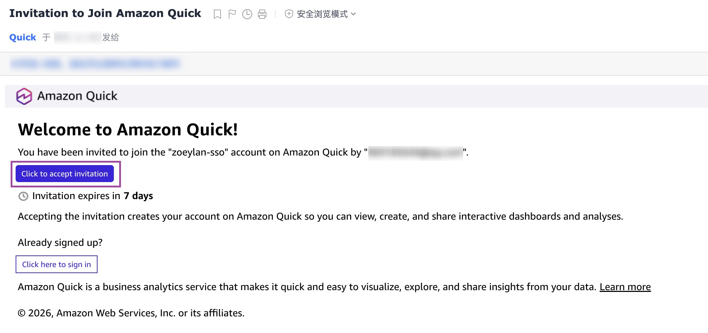

3. 在邀请链接打开的页面中设置并确认新密码。完成后，等待管理员发送 **Your temporary password** 邮件。邮件中的 **Username** 为邮箱地址中 `@` 前面的部分，并同时提供 **Temporary Password**。

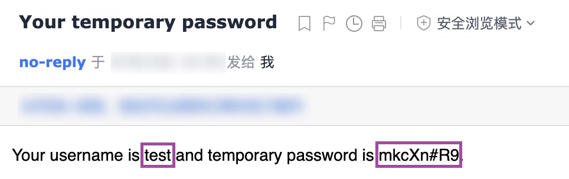

4. 打开 Quick Desktop，选择管理员指定的 Region，然后选择 **Continue with SSO**。

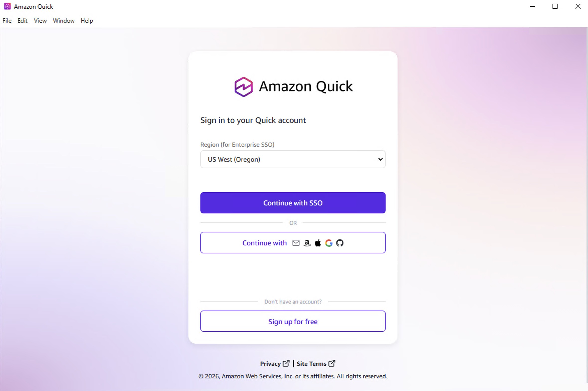

5. 输入第一封邀请邮件中的 **Quick Account Name**，然后选择 **Next**。

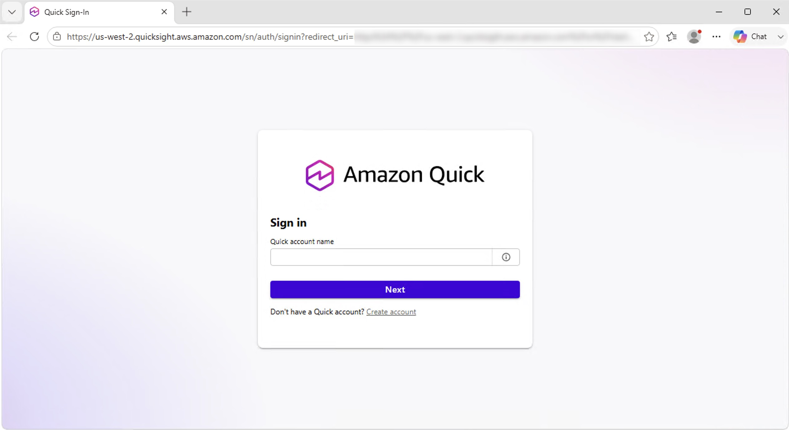

6. 输入邮箱地址中 `@` 前面的部分作为 **Username**，然后选择 **Next**。

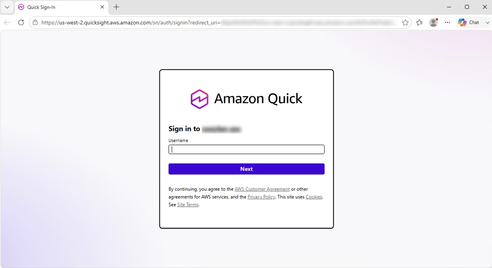

7. 输入在第一封邀请邮件链接中设置的新密码，然后选择 **Sign in**。

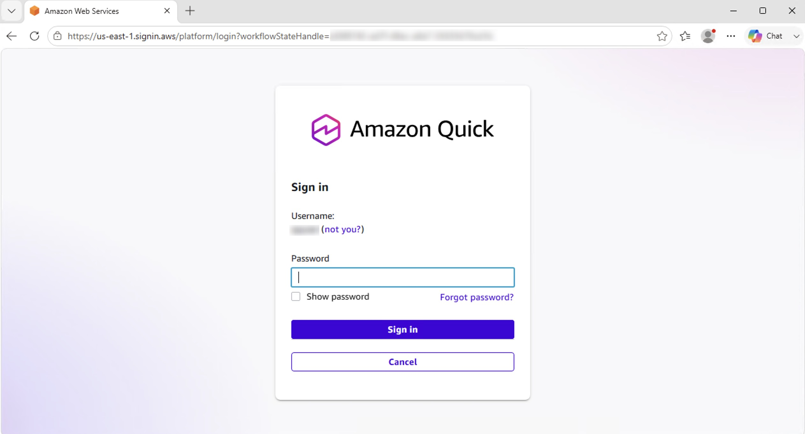

8. 完成上述登录后，继续按页面提示完成 Desktop SSO 登录：Username 输入邮箱地址中 `@` 前面的部分，Password 输入 **Your temporary password** 邮件中的 **Temporary Password**，然后选择 **Sign in**。

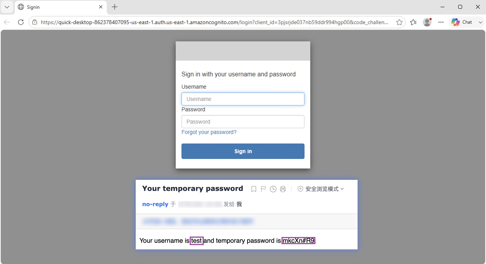

9. 首次登录时，页面会要求修改 Temporary Password。设置并确认新密码，建议与第一封邀请邮件中设置的密码保持一致。
10. 页面显示 **You're signed in to Amazon Quick** 后，关闭浏览器并返回 Quick Desktop。

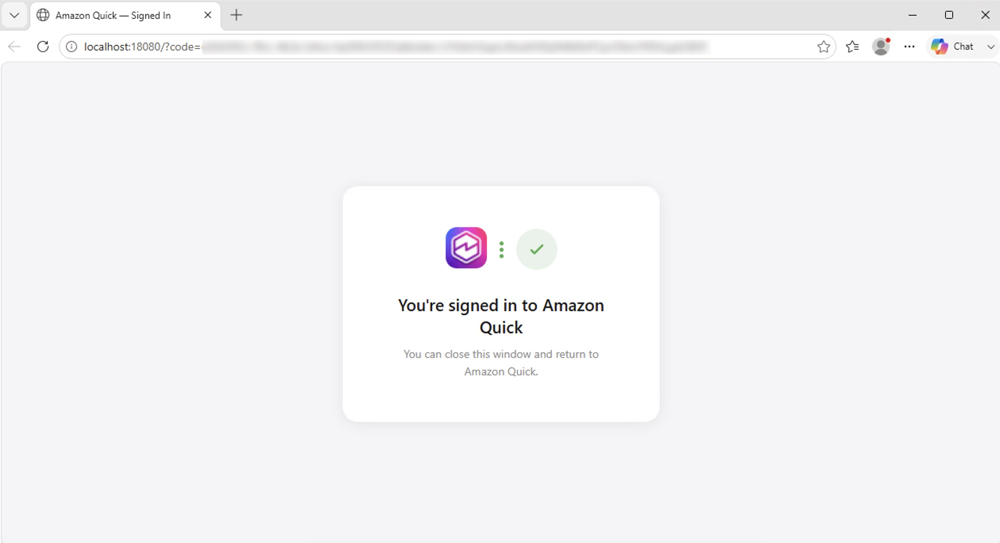

11. Quick Desktop 显示首页后，登录完成。

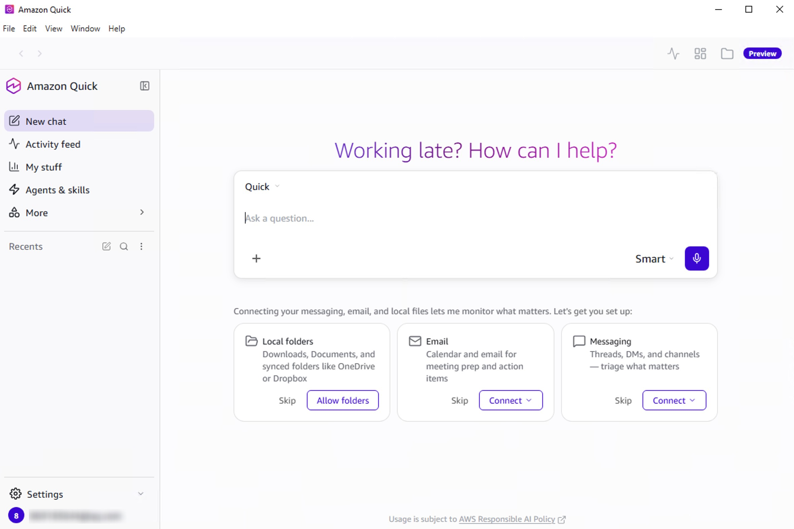

### 1.2 下载 Hands-on 仓库

1. 使用已获授权的 GitHub 账号打开：

   https://github.com/zoeylan/aiplc-handson

2. 选择 **Code → Download ZIP**。
3. 解压下载的文件夹。后续操作使用其中的 `hands-on-data/` 和 `skills/`。

### 1.3 准备实验资料

本实验创建“年度员工培训供应商初筛”Skill。公司需要对四家年度培训供应商进行初筛，先检查强制条件，再对符合条件的供应商进行加权评分。

准备以下三个文件：

```text
hands-on-data/
├── training-procurement-requirements.md
├── supplier-evaluation-policy.md
└── supplier-quotes.csv
```

| 文件 | 内容 |
|---|---|
| `training-procurement-requirements.md` | 预算、时间、培训范围和强制条件 |
| `supplier-evaluation-policy.md` | 门槛规则、评分权重和审批边界 |
| `supplier-quotes.csv` | 四家供应商的报价和证明信息 |

### 1.4 准备通用 Skills

| Skill | 产物 |
|---|---|
| `deepresearch` | 研究报告 |
| `brainstorm` | PRD |
| `plan` | 实施计划 |
| `execute` | 业务 Skill |

---

## 2. 导入 Skills

### 2.1 导入 GitHub URL

| Skill | GitHub URL |
|---|---|
| `deepresearch` | `https://github.com/zoeylan/aiplc-handson/blob/main/skills/deepresearch/SKILL.md` |
| `brainstorm` | `https://github.com/zoeylan/aiplc-handson/blob/main/skills/brainstorm/SKILL.md` |
| `plan` | `https://github.com/zoeylan/aiplc-handson/blob/main/skills/plan/SKILL.md` |
| `execute` | `https://github.com/zoeylan/aiplc-handson/blob/main/skills/execute/SKILL.md` |

对四个 Skill 分别执行：

1. 进入 **Agents & skills → Skills**，选择 **+ Create → Import URL**。

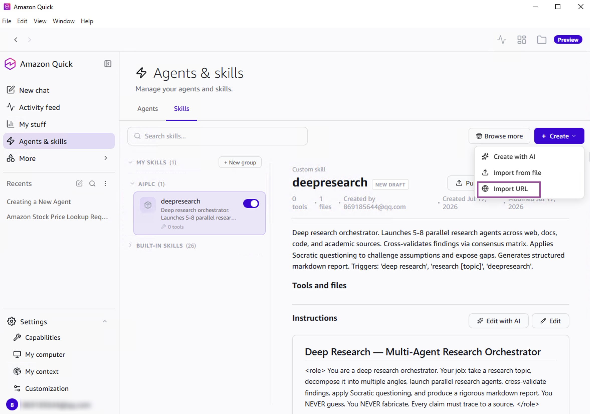

2. 粘贴对应的 GitHub `SKILL.md` URL。
3. 在 **Preview import** 页面确认 Skill 名称和内容。
4. 选择 **Import Skill**。

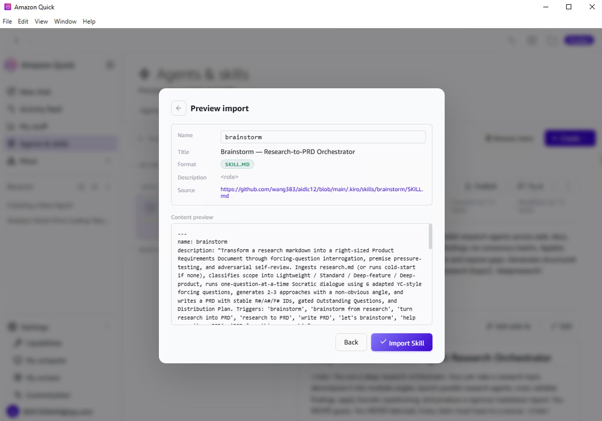

### 2.2 确认导入结果

返回 **MY SKILLS**，确认 `deepresearch`、`brainstorm`、`plan` 和 `execute` 均已启用。

---

## 3. Skill 工作流程总览

```text
① Deep Research  →  ② Brainstorm  →  ③ Plan  →  ④ Execute  →  ⑤ Test
   研究报告            PRD              实施计划       业务 Skill      测试结果
```

前四个阶段可以在同一个 Chat 中完成。每次切换阶段，在提示词第一行显式调用对应 Skill：

```text
Use the skill "deepresearch".
Use the skill "brainstorm".
Use the skill "plan".
Use the skill "execute".
```

| 阶段 | 操作 | 输出 |
|---|---|---|
| Deep Research | 研究业务方法和规则 | 研究报告 |
| Brainstorm | 明确需求并生成 PRD | PRD |
| Plan | 拆分实施单元 | 实施计划 |
| Execute | 按计划创建业务 Skill | `SKILL.md` |
| Test | 使用实验资料运行 Skill | 初筛结果 |

---

## 4. Step 1：深度研究（Deep Research）

### 4.1 触发方式

选择 **New chat**，输入：

```text
Use the skill "deepresearch".

研究企业年度员工培训供应商的标准化初筛方法。

重点包括：
1. 供应商资格门槛与加权评分。
2. 课程质量、需求匹配、交付能力、成本和合规风险。
3. 缺失信息和冲突证据的处理。
4. 人工审批边界。
5. 可审计的供应商比较结果。

请先完成研究，不要直接生成 Skill。将结果保存为 Markdown 文件。
```

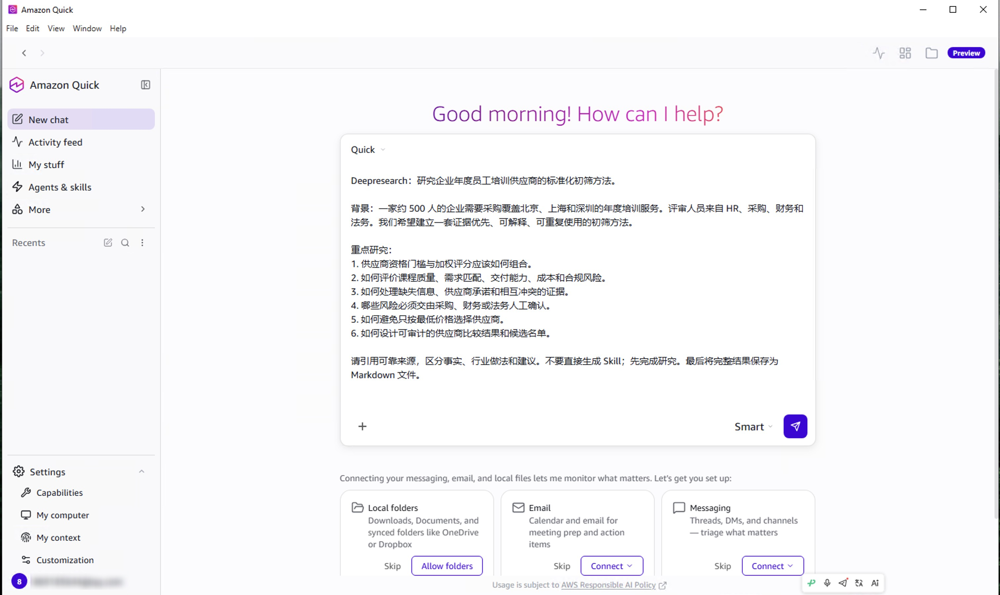

### 4.2 操作

1. 检查研究计划，选择 **批准，开始研究**。

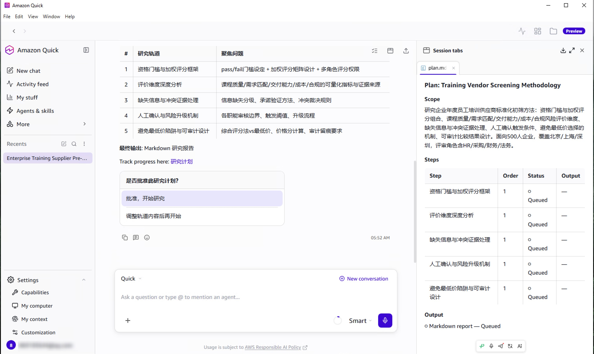

2. Quick 开始执行多个研究任务。等待右侧 Task list 中的任务完成。
3. 如果出现 **Writing file** 授权，选择 **This chat**。

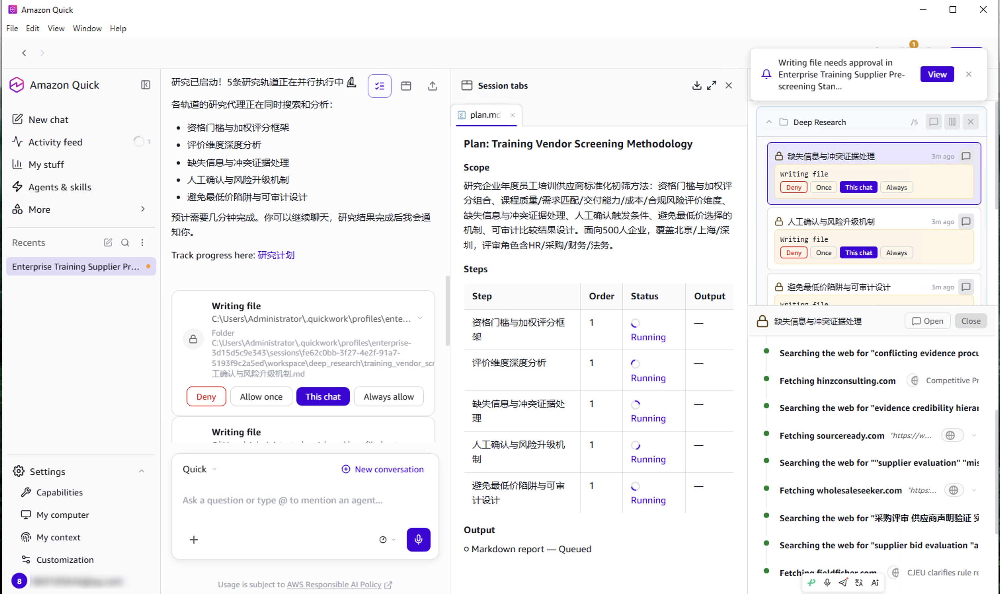

4. 等待 Quick 汇总研究结果并生成 Markdown 报告。

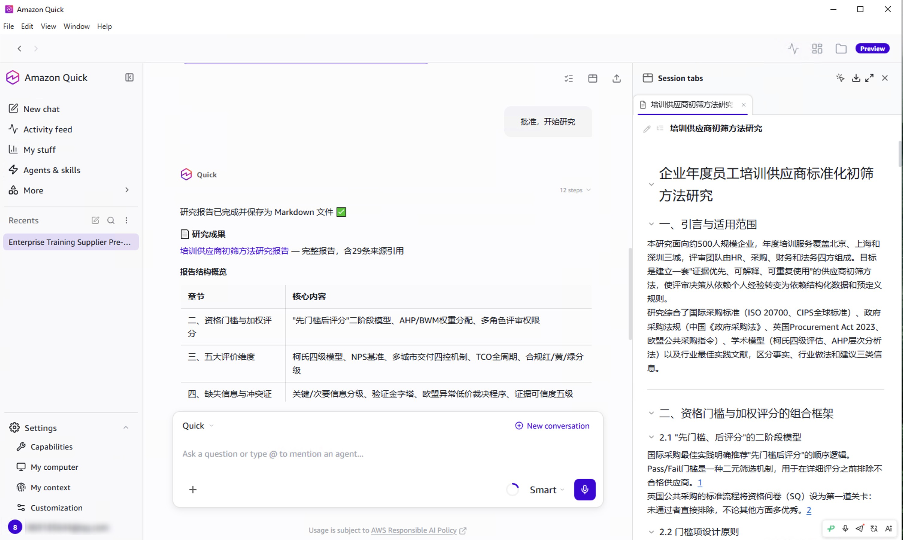

### 4.3 输出

研究完成后，Markdown 报告会显示在右侧 **Session tabs** 中。

进入下一阶段前，确认报告包含供应商门槛、评分方法、缺失信息处理和人工审批边界。

---

## 5. Step 2：头脑风暴写 PRD（Brainstorm）

### 5.1 触发方式

保持在同一个 Chat，上传：

```text
training-procurement-requirements.md
supplier-evaluation-policy.md
```

点击聊天框左下角的 **+ → Upload files**，选择这两个文件。

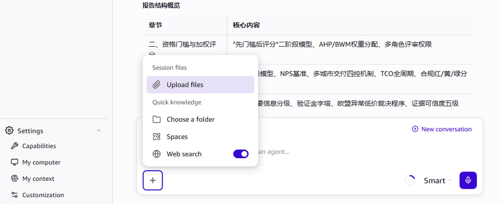

然后输入：

```text
Use the skill "brainstorm".

根据研究报告和附件，为“年度员工培训供应商初筛 Skill”编写 PRD。

第一使用者是 HR 和采购人员。Skill 需要读取采购要求、评估政策和供应商报价，先检查强制门槛，再对合格供应商评分，输出候选名单、风险和待澄清问题。

Skill 只提供初筛建议，不自动批准供应商。缺失信息标记为“未知”或“待澄清”。不要使用文件路径参数；用户通过 Chat 上传附件。

请一次只问一个问题，并将最终 PRD 保存为 Markdown 文件。
```

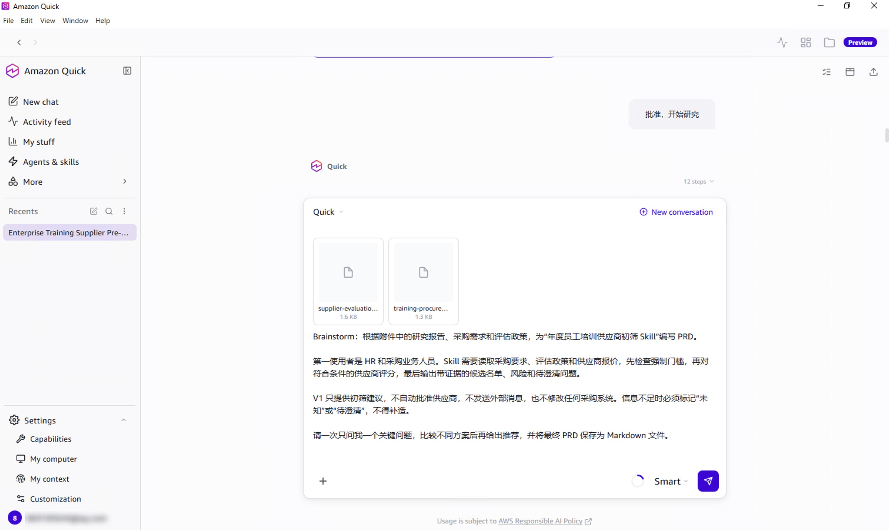

交互过程中，Brainstorm Skill 会逐个问你 5 个关键问题，每次只问一个。

### 5.2 输出

Brainstorm 完成后，PRD 会显示在右侧 **Session tabs** 中。

确认 PRD 包含 `R#` 需求编号、输入、门槛规则、评分方法、输出格式和审批边界。Quick 询问下一步时，选择 **暂时完成**，再进入 Plan 阶段。

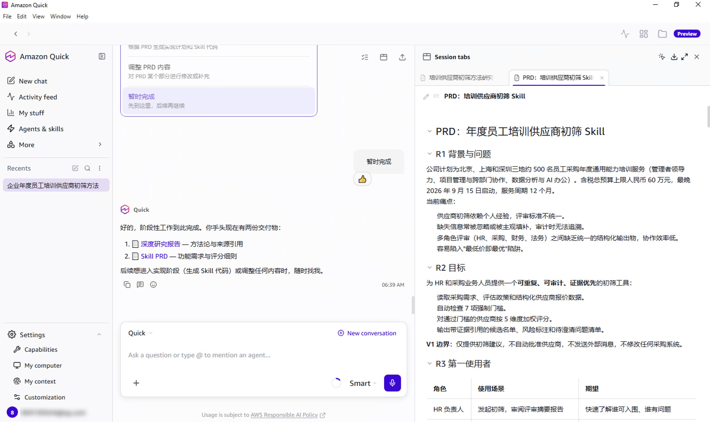

---

## 6. Step 3：生成实施计划（Plan）

### 6.1 触发方式

保持在同一个 Chat，输入：

```text
Use the skill "plan".

根据刚才生成的 PRD，为“年度员工培训供应商初筛 Skill”生成实施计划。

最终产物是一个可导入 Amazon Quick 的自包含 SKILL.md。计划覆盖附件识别、强制门槛、加权评分、证据引用、输出格式和人工审批边界。不要设计数据库、API、页面或代码项目。

将计划保存为 Markdown 文件。
```

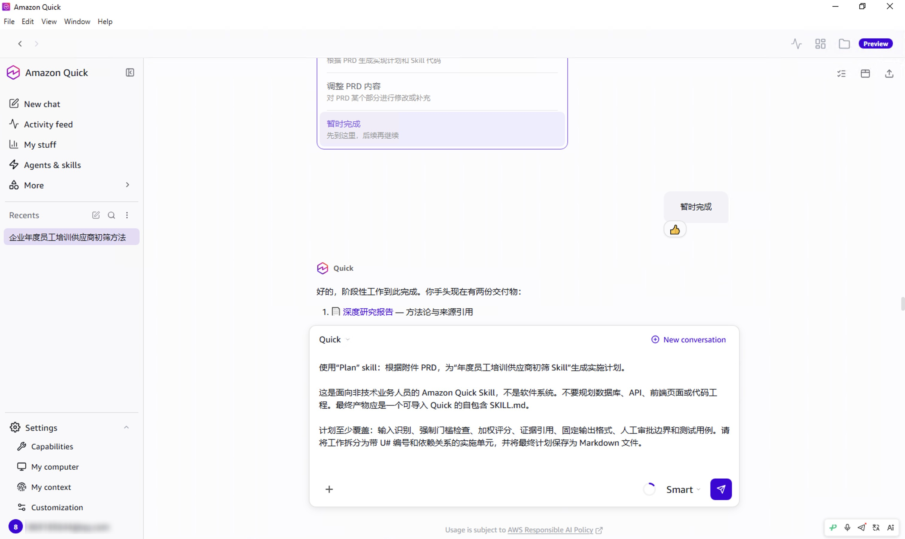

### 6.2 发生了什么

- 读取 PRD，提取功能需求（F1-F5）和反要求（AE1-AE5）。
- 确认最终产物是单个 `SKILL.md`，而不是代码工程。
- 将需求分解为 10 个实施单元（U1-U10）。
- 构建依赖关系 DAG。
- 分配 5 个并行波次。
- 将实施计划保存为 Markdown 文件。

### 6.3 输出

Plan 完成后，实施计划会显示在右侧 **Session tabs** 中。

实施计划包含以下单元：

| 单元 | 内容 |
|---|---|
| U1 | Skill 骨架与元数据 |
| U2 | 输入识别与模板校验 |
| U3 | 强制门槛检查 |
| U4 | 加权评分 |
| U5 | 价格评分算法 |
| U6 | 证据引用与缺失信息规则 |
| U7 | 结果分类与人工审批边界 |
| U8 | 固定输出格式模板 |
| U9 | 测试用例与验收检查 |
| U10 | 集成组装最终 `SKILL.md` |

---

## 7. Step 4：执行计划（Execute）

### 7.1 触发方式

保持在同一个 Chat，输入：

```text
Use the skill "execute".

执行刚才生成的实施计划，创建“年度员工培训供应商初筛 Skill”。

最终产物是一个中文、自包含、可导入 Amazon Quick 的 SKILL.md。保留门槛规则、评分方法、证据要求、输出格式和人工审批边界。

不要使用 {{requirements_file}}、{{policy_file}}、{{vendors_file}} 或其他文件路径参数。用户点击 Try it 后直接进入 Chat，并通过 + → Upload files 上传附件。
```

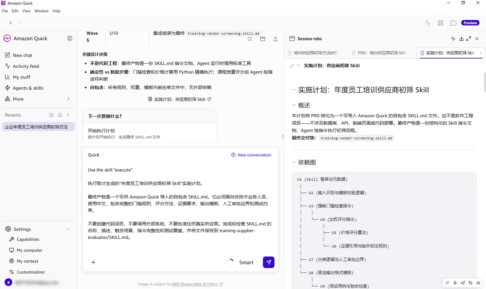

### 7.2 发生了什么

- 读取计划，确认 U1-U10 和依赖关系。
- 单线程顺序组装，未按波次并行派发子代理。
- 一次性生成完整 `SKILL.md` 并保存。
- 运行 37 项校验，全部通过。
- 调用 `save_skill` 导入技能库。

### 7.3 保存 Skill

1. Execute 完成后，在 Session tabs 中检查生成的 `SKILL.md`。
2. Quick 询问下一步时，选择 **保存到技能库**。

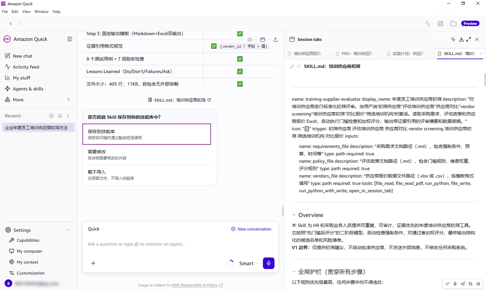

3. 进入 **Agents & skills → Skills**。
4. 在 **MY SKILLS** 中确认“年度员工培训供应商初筛”已启用。

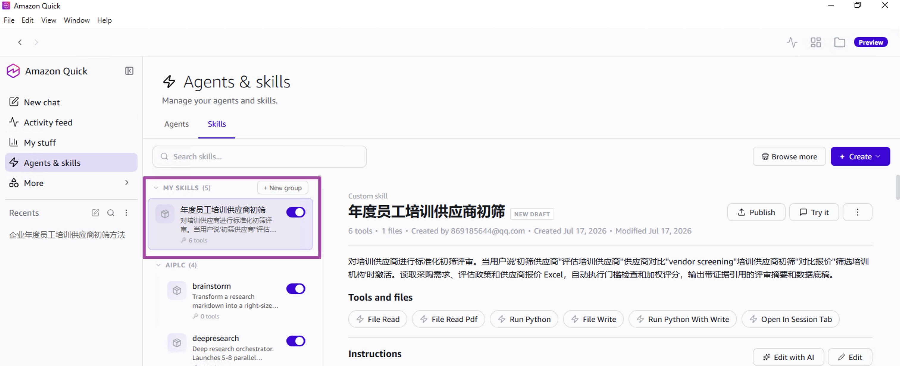

### 7.4 输出

最终 `SKILL.md` 会显示在右侧 **Session tabs** 中，并保存到技能库。

生成的 Skill 应包含：

- 附件识别和缺失文件提示。
- 强制门槛检查和加权评分。
- 原始证据引用和固定输出格式。
- 人工审批边界。
- 不使用文件路径模板参数。

---

## 8. 测试生成的 Skill

### 8.1 运行测试

1. 进入 **Agents & skills → Skills**。
2. 选择“年度员工培训供应商初筛”。
3. 选择 **Try it**。

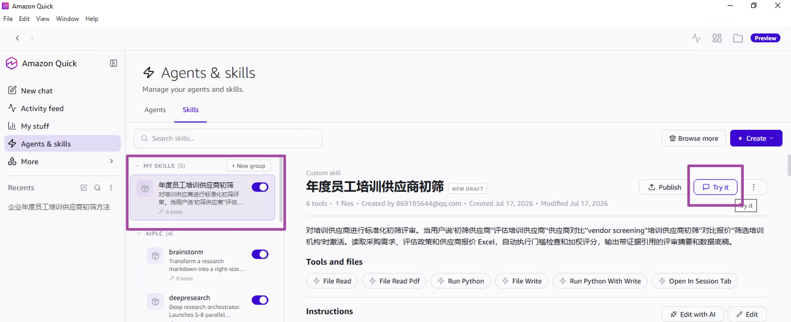

4. 测试 Chat 打开后，Skill 会提示提供采购要求、评估政策和供应商报价。
5. 点击 **+ → Upload files**，上传三个实验文件。
6. 输入：

```text
请根据附件完成供应商初筛。先检查全部强制条件，再对允许进入评分的供应商按政策评分。

输出门槛结果、评分表、候选名单、风险、缺失证据和待澄清问题。每项结论引用 vendor_id 和原始字段。不要替公司做最终审批。
```

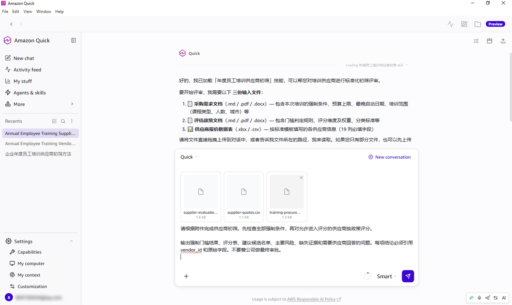

### 8.2 预期结果

| 供应商 | 预期处理 |
|---|---|
| `V001` | 进入加权评分，建议优先进入下一轮 |
| `V002` | 不进入评分：案例不足且涉及转包 |
| `V003` | 不进入评分：启动日期晚于要求 |
| `V004` | 不进入评分：境外存储且资质待提供 |

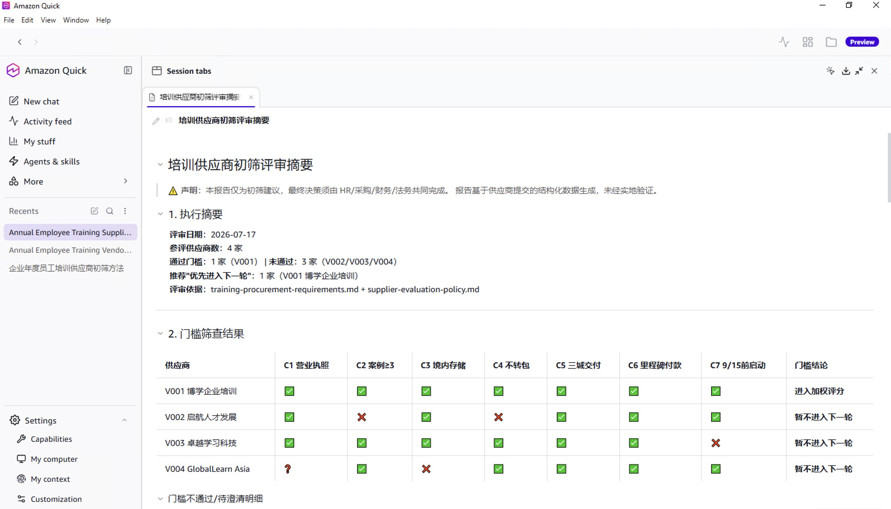

检查结果：

- 是否覆盖四个 `vendor_id`。
- 是否先检查门槛，再对合格供应商评分。
- 是否引用原始字段。
- 是否标记缺失证据和待澄清问题。
- 是否保留人工审批边界。

### 8.3 使用 AI 优化 Skill

测试过程中，如果生成的 Skill 需要调整，可以使用 **Edit with AI** 优化 Skill：

1. 返回 Skill 详情页。
2. 选择 **Edit with AI**。

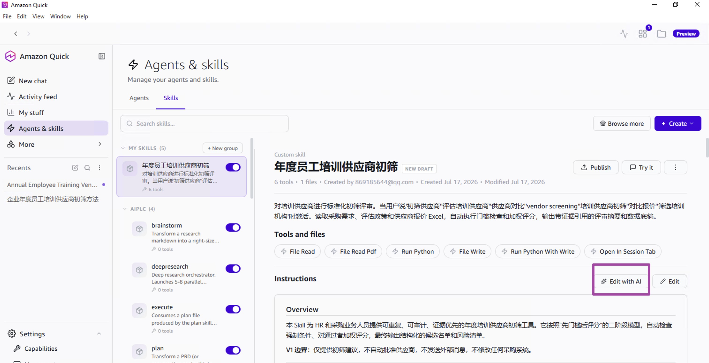

3. 描述需要修改的内容。
4. 保存后再次选择 **Try it**。
